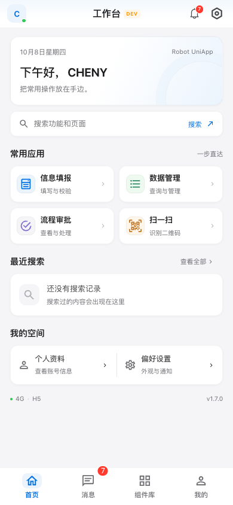
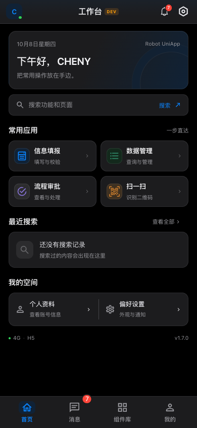
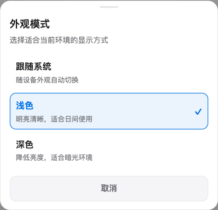

<div align="center">
  <h1>🤖 Robot UniApp</h1>
  <p><strong>企业级跨平台移动应用开发框架</strong></p>
  <p><em>一次开发，多端运行 | 现代化架构 | 开箱即用</em></p>

  <p>
    
    
    
    
    
    
  </p>
</div>

---

## 🚀 项目简介

**Robot UniApp** 是基于 **Vue 3 + uni-app + TypeScript + UnoCSS + Pinia + wot-design-uni** 的跨平台移动应用模板，支持 H5 / 微信小程序 / App 多端开发。

当前固定版本 **v1.7.2**：统一操作菜单与弹窗设计，完善跨端能力注册、请求/上传状态和生产 Mock 隔离；保留全页面导航加载与墨黑几何 R 站点图标。以 Git 标签 `v1.7.2` 作为当前阶段基线，后续优化从此版本继续；详细变更见 [CHANGELOG.md](./CHANGELOG.md)。

H5、微信小程序和 App 资源已完成构建验证；钉钉、PDA 与 Robot H5 宿主仍需真实 SDK、接口和设备联调，各平台的实际支持边界与验收见 [多端基础与后续接入](./docs/platform-readiness.md)。本仓库使用 uni-app 自身技术栈与质量检查，开发约定见 [AGENTS.md](./AGENTS.md)，未接入 PC 管理端 Kit。

- H5 / 小程序 / App 共用一套业务代码，静态演示页隔离在独立分包
- 首页工作台提供信息填报、数据管理、流程审批、扫一扫 4 个常用应用，以及个人资料与偏好设置入口；最近搜索读取本机历史，无记录时展示真实空状态
- 请求层内置去重、指数退避重试（仅网络错误/5xx）、页面级取消、401 统一处理与登录回跳
- 身份代次（request-context）：登出/切号自动中止在途请求并隔离去重缓存
- 开发演示由 `VITE_MOCK_ENABLED` 显式控制（与 HTTP 层同协议：`code === 0` 为成功）；测试/预发布默认真实联调，生产构建强制排除 Mock
- 分级日志（`VITE_LOG_LEVEL`）与全局错误脱敏收集（token/openid 自动打码，可注册上报钩子）
- 平台能力层（`src/platform`）：扫码/定位/拍照统一入口、实际能力查询、部分宿主注册/撤销、就绪超时与降级；钉钉/PDA 需注入真实实现
- 断点续传状态机支持暂停/删除、账号与环境隔离；App 更新基础模块强制 SHA-256 校验；实际后端、文件持久保存和真机发布仍需接入验收
- 简繁转换（`VITE_FEATURE_TW` 开关，opencc 字典懒加载，默认零包体成本）
- 契约测试 5 项（版本同步/路由守卫/HTTP 协议/API↔Mock 同步/平台隔离）+ Vitest 行为测试；H5/微信/App 资源构建与包体预算门禁（`pnpm check:budget`）
- 路由守卫采用「默认需登录 + 白名单放行」，并支持按页面配置角色/权限
- 33 个公开 `C_*` 组件演示，按基础/布局/表单/展示/反馈独立分类，支持搜索；`C_Icon` 使用实际 SVG 图标资源，wot-design-uni 按需引入
- 统一 Toast、可输入 Modal、操作菜单与加载反馈，保留回调/Promise、共享交互队列及加载所有权，覆盖启动、页面导航与行内加载
- 类型检查（vue-tsc）、oxlint + ESLint、commitlint + husky 全链路质量保障

<table>
  <tr>
    <td align="center"><br>浅色工作台</td>
    <td align="center"><br>深色工作台</td>
  </tr>
</table>

> 截图来自 v1.7.0，使用开发演示账号 CHENY，最近搜索为空，工作台不展示组件统计或演示待办。

<p align="center">
  <br>
  v1.7.2 操作菜单预览
</p>

---

## ⚡ 快速开始

### 环境要求

- Node.js **20.19+（20.x） / 22.13+（22.x） / ≥24**（ESLint 10 要求；CI 使用 20.x）
- pnpm **10.x**（与 CI 一致）

### 安装与启动

```bash
pnpm install        # 安装依赖（pnpm-workspace.yaml 已声明允许构建的依赖）
pnpm dev            # H5 开发（端口 1999，默认演示，可关闭 Mock）
pnpm dev:wx         # 微信小程序开发（需微信开发者工具）
pnpm dev:app        # App 开发（需 HBuilderX）
```

> 开发环境演示账号：`CHENY / 123456`（仅 Mock，登录页有提示；`admin / admin123` 亦可）。短信登录任意合法手机号 + 4-6 位验证码。

> 演示模式仅在 development 默认开启；`dev:test`、`dev:staging` 默认连接环境配置的后端。用 `VITE_MOCK_ENABLED=false` 关闭演示后登录不预填密码，也不提示短信已发送。测试环境如需演示可显式设为 `true`，生产构建仍不会打包 Mock。

### 常用命令

| 命令                                    | 说明                                               |
| --------------------------------------- | -------------------------------------------------- |
| `pnpm dev` / `dev:wx` / `dev:app`       | 各端开发模式（默认演示，可关闭 Mock）              |
| `pnpm dev:test` / `dev:staging`         | 测试/预发布环境 dev server                         |
| `pnpm build` / `build:wx` / `build:app` | 生产构建                                           |
| `pnpm build:test` / `build:staging`     | 测试/预发布构建                                    |
| `pnpm type-check`                       | vue-tsc 全量类型检查                               |
| `pnpm test`                             | 5 项契约测试（版本/守卫/协议/Mock/平台）+ 单元测试 |
| `pnpm test:unit`                        | vitest 单元测试（tests/）                          |
| `pnpm check:budget`                     | 构建产物包体预算门禁                               |
| `pnpm check:quality`                    | type-check + lint:check + test 一键全检            |
| `pnpm lint`                             | oxlint + ESLint 检查并修复                         |
| `pnpm cz`                               | 交互式规范化提交                                   |
| `pnpm push`                             | 推送当前分支到 origin                              |

---

## 🏗️ 项目架构

```
├── env/                      # 环境变量（单一配置源，vite envDir 指向此处）
│   ├── .env                  # 通用配置
│   ├── .env.development      # 开发（H5 走 /api 代理 → VITE_API_PROXY_TARGET）
│   ├── .env.test / staging / production
├── src/
│   ├── api/                  # API 工厂 + 业务接口模块（类型化）
│   ├── components/global/    # 33 个公开演示组件 + 6 个内部设施（easycom 自动注册）
│   ├── components/local/     # ComponentCatalog 组件目录
│   ├── composables/          # useUpload / useWebSocket / useModal / usePagination ...
│   ├── config/env.ts         # 读取 VITE_* 并导出类型化运行时配置
│   ├── constants/            # RESPONSE_CODE / 业务枚举 / 正则
│   ├── directives/           # v-auth / v-role 权限指令（仅 H5，小程序用 v-if 方案）
│   ├── mock/                 # Mock 拦截器（DEV + 显式开关，code:0 协议）
│   ├── pages/                # 主包 7 页 + 12 个分包 45 页，共 52 页
│   ├── stores/               # Pinia + 持久化（uni storage 适配器）
│   ├── styles/               # 设计 token（:root + page 双挂载）/ reset / mixins
│   ├── types/                # UserInfo / LoginResult / PageResult 等共享类型
│   ├── utils/                # http(+helpers/types) / router(守卫) / url-policy / logger / format / error-handler
│   └── main.ts               # 入口：错误处理 → Pinia/反馈 → 守卫依赖注入 → DEV Mock
├── uno.config.js             # UnoCSS（图标集显式声明，避免环境性加载失败）
└── vite.config.js            # envDir=env / AutoImport / 生产 drop console
```

页面沿用现有 `index.vue`（模板与解构）、`data.ts`（状态与业务逻辑）、`index.scss`（样式）、`api.md`（接口契约）组织。组件目录与首页工作台各有独立职责，展示组件按职责和实际复杂度拆分。

`components/global` 当前共 39 个目录：33 个公开演示组件，另有环境标识、退出过渡、虚拟状态栏及 `C_FeedbackHost`、`C_NativeFeedbackHost`、`C_LoadingIndicator` 6 个内部设施；内部设施不计入组件目录的 33 项。

---

## 🔧 核心机制说明

### 请求层（`src/utils/http.ts`）

- 响应协议：HTTP 200 且 `code === 0`（`RESPONSE_CODE.SUCCESS`）为成功
- GET 默认重试 2 次，**仅网络错误/5xx 重试**（指数退避），业务错误不重试
- 401 统一处理：清登录态 → 保存 `REDIRECT_URL` → reLaunch 登录页（并发去重）；登录成功后由 `consumeRedirectUrl()` 回跳
- 页面级请求取消：`C_Layout` 在页面 `onUnload` 时自动调用 `http.cancelPageRequests`

### 路由守卫（`src/utils/router.ts`）

- 模型：**默认所有页面需要登录**，`WHITE_LIST` 放行（登录/注册/引导）
- 基于 `uni.addInterceptor` 拦截 navigateTo/redirectTo/reLaunch/switchTab
- `PERMISSION_PAGES` 可按页面声明角色/权限要求

### Mock（`src/mock/`）

- 必须同时满足 `import.meta.env.DEV` 与 `config.MOCK_ENABLED`；`main.ts` 动态挂载，Mock 安装入口也验证开关（生产构建不打包）
- 拦截 `uni.request`，按 `METHOD /path` 匹配（自动剥离 baseURL 前缀）
- 与业务层同一成功协议（`success()` 返回 `code: 0`）
- DEV Mock 用于交互演示与契约验证；生产构建请求 `env/` 配置的后端，演示账号与 Mock 数据不作为生产服务

### 统一反馈（`src/utils/feedback.ts`）

- 启动时接管 `uni.showToast/showModal/showActionSheet/showLoading/hideLoading/hideToast`，保留回调与 Promise；输入弹窗返回 `content`，菜单返回 `tapIndex`，两者共用队列。菜单取消触发 fail/complete，Promise 调用方需处理取消
- H5 使用持久化 `C_FeedbackHost`；小程序/App 由当前页面的 `C_NativeFeedbackHost` 展示，避免缓存页面重复弹出
- 手动、HTTP、导航、组件与启动加载分别维护 owner，合并展示一层加载；结束自己的加载不会关闭其他任务，全局与按钮/列表行内加载共用 `C_LoadingIndicator`
- 四个 Tab 及 navigateTo/redirectTo/reLaunch/navigateBack 共用导航反馈；重复点击当前 Tab 不触发加载，首次页面由 onReady、缓存页面由 onShow 确认准备，两者均等待视图绘制与导航 API 成功，并保留 220ms 入场时间
- 页面 onShow 的实际路径变化补齐浏览器历史、系统返回的加载反馈；同一路径回到前台不触发，导航失败或异常超时自动释放自己的加载，保留 SDK 回调、Promise 与登录/权限守卫
- 反馈、工作台与业务页共用设计 token，视觉参考 RobotH5 与 wl-mbase，并保留当前 uni-app 页面及接口约定
- 主题/语言、网页及图片操作菜单使用统一反馈层；消息/部门选择使用同一设计的 `C_ActionSheet`，与 Modal、日历、级联选择、数字键盘共享浮层令牌

### 环境配置

- 单一配置源：`env/` 目录的 `VITE_*` 变量（`vite.config.js` 已设 `envDir: 'env'`）
- `src/config/env.ts` 负责读取并导出类型化配置；`VITE_ENV` 决定环境（development/test/staging/production）
- H5 开发用相对路径 `/api` 走 vite proxy；小程序/App 自动回退到 `VITE_API_PROXY_TARGET` 绝对地址
- H5 可用 `?env=xxx` 临时切换环境（**仅开发构建**，生产被摇树移除）
- 功能开关：`VITE_FEATURE_TW`（简繁转换，默认关）等见 `env/.env`

### WebView 安全（`src/utils/url-policy.ts`）

- WebView 页面仅允许加载**白名单内**的 https 地址（`WEBVIEW_ALLOWED_HOSTS`，支持 `*.example.com` 通配）
- 扫码结果打开链接前弹窗展示域名并要求用户确认
- 接入业务时请把业务域名加入白名单

### 设计 Token 与双主题（`src/styles/variables.scss` + `composables/useTheme`）

- 命名约定 `--r-{类别}-{语义}`，同时挂载 `:root`（H5）与 `page`（小程序/App）
- **亮/暗双主题**：暗色值经 `.theme-dark`（C_Layout 根节点类，CSS 变量向子树级联）
  与 `[data-theme='dark']`（H5 html）双选择器覆盖，全端生效
- **wot-design-uni 官方暗色集成**：C_Layout/webview/scan 内容经 `wd-config-provider`
  包裹，`:theme` 随应用主题联动；`themeVars` 将品牌 token（colorTheme/语义色/文字色）
  注入组件库，业务 token 与组件库 token 单向统一
- 主题模式：浅色 / 深色 / 跟随系统（`uni.onThemeChange` 实时跟随），设置页可切换，选择持久化
- H5 站点图标使用自绘的 [SVG Robot 字标](./src/static/favicon.svg)：墨黑底、暖白几何 R 与负形双眼，由 `index.html` 接入，资源地址跟随部署 base
- 组件内请使用 `var(--r-color-primary)` 等 token，避免硬编码色值（破坏暗色）
- 应用级网络状态由 app store 管理：合并 Uni 网络事件与 H5 online/offline 事件，连接状态切换时去重提示，卸载时清理监听

---

## 📱 页面一览

| 分类         | 页面                                                                                                 | 数据来源                                                               |
| ------------ | ---------------------------------------------------------------------------------------------------- | ---------------------------------------------------------------------- |
| 主包（7 页） | 登录（账号/短信）、首页工作台、消息中心、组件库、个人中心、设置、修改密码                            | 业务 API（登录/用户/消息）；工作台入口与本机搜索历史；组件目录本地数据 |
| 业务模板     | crud-list 列表 / form-template 表单 / approval 审批 / dashboard 看板 / detail 详情                   | 真实 API（crud/approval/dashboard/form）                               |
| 功能         | scan 扫码（URL 确认）/ webview（白名单）/ guide 首次启动引导 / about / register / search-result 搜索 | 注册接业务 API；其余使用设备能力、配置或本地数据                       |
| 组件演示     | `pages/demo` 独立分包，1 个目录页 + 33 个组件演示页                                                  | 本地演示数据                                                           |

> `pages.json` 共登记 52 页（主包 7 页，12 个分包合计 45 页）。开启演示 Mock 时业务 API 由 `src/mock` 供应（同一 `code:0` 协议）；正式联调需配置 `env/` 地址并核对接口字段、认证与权限。

---

## 🧪 质量保障

```bash
pnpm type-check   # vue-tsc --noEmit（0 错误）
pnpm lint:check   # oxlint + eslint（只检查）
pnpm test         # 5 项契约测试 + 308 例单测（26 个测试文件）
pnpm build:h5     # H5 生产构建
pnpm build:wx     # 微信小程序生产构建 + WXSS 后处理与校验
pnpm build:app    # App 资源构建（安装包和真机另行验收）
pnpm check:budget # H5/微信小程序包体预算
```

- v1.7.2 微信生产构建覆盖 52 个登记页面，WXSS 后处理校验 94 个样式文件，包含扩展名还原、引用核对及不支持样式清理
- H5 浏览器 21 项交互与布局检查通过，覆盖菜单选择/取消、混合弹窗队列、选择回填、键盘焦点、四个 Tab、亮/暗主题、小屏/桌面与扫码适配器注册/撤销；微信小程序/App 真机仍待设备验收
- 提交：husky + lint-staged（本地 `pnpm exec`，无需联网）+ commitlint
- CI：GitHub Actions（lint → type-check → test → H5/微信/App 资源构建 → 包体预算），见 `.github/workflows/ci.yml`
- 变更记录：[CHANGELOG.md](./CHANGELOG.md)
- 生产构建自动移除 `console`/`debugger`
- 已知限制：wot-design-uni@1.14.0 内部存在一个上游类型错误（`useUpload.ts`），为通过 `type-check` 暂未启用其 `global.d.ts` 全局组件模板类型；升级新版后可恢复

---

## 📄 接入指引（新项目 Checklist）

1. 替换 `env/` 中的 API/WS/CDN 地址为真实后端（业务页已按 mock 契约请求，仅需后端对齐 `code:0` 协议与字段）
2. 在 `src/utils/url-policy.ts` 配置 WebView 域名白名单
3. 在 `src/manifest.json` 填入微信 `appid`（或使用 CI 注入），并按需调整 App 权限
4. 对照 `src/api/modules/` 替换真实接口定义与返回类型（各页已按类型消费）
5. 按需调整 `src/utils/router.ts` 的 `WHITE_LIST` 与 `PERMISSION_PAGES`
6. 按业务需要替换模板数据与交互，首页最近搜索继续使用本机历史；新增入口须与 `pages.json` 已登记路由一致

---

## 📜 License

私有项目，未配置开源许可证。
